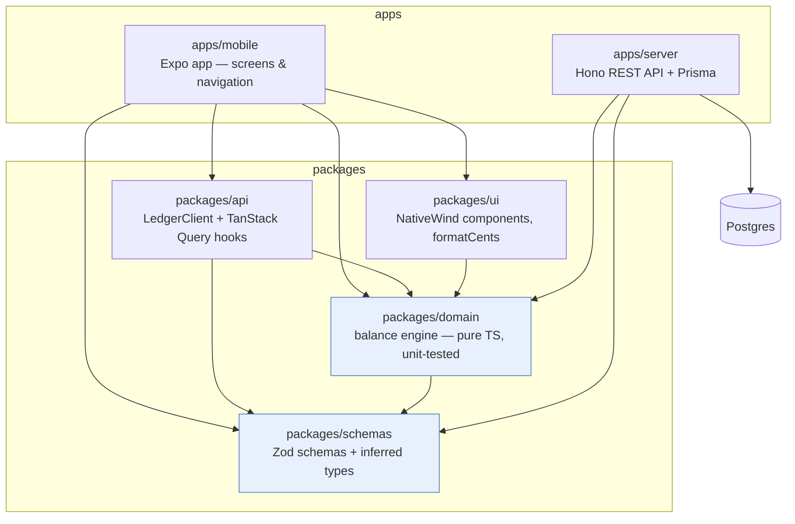
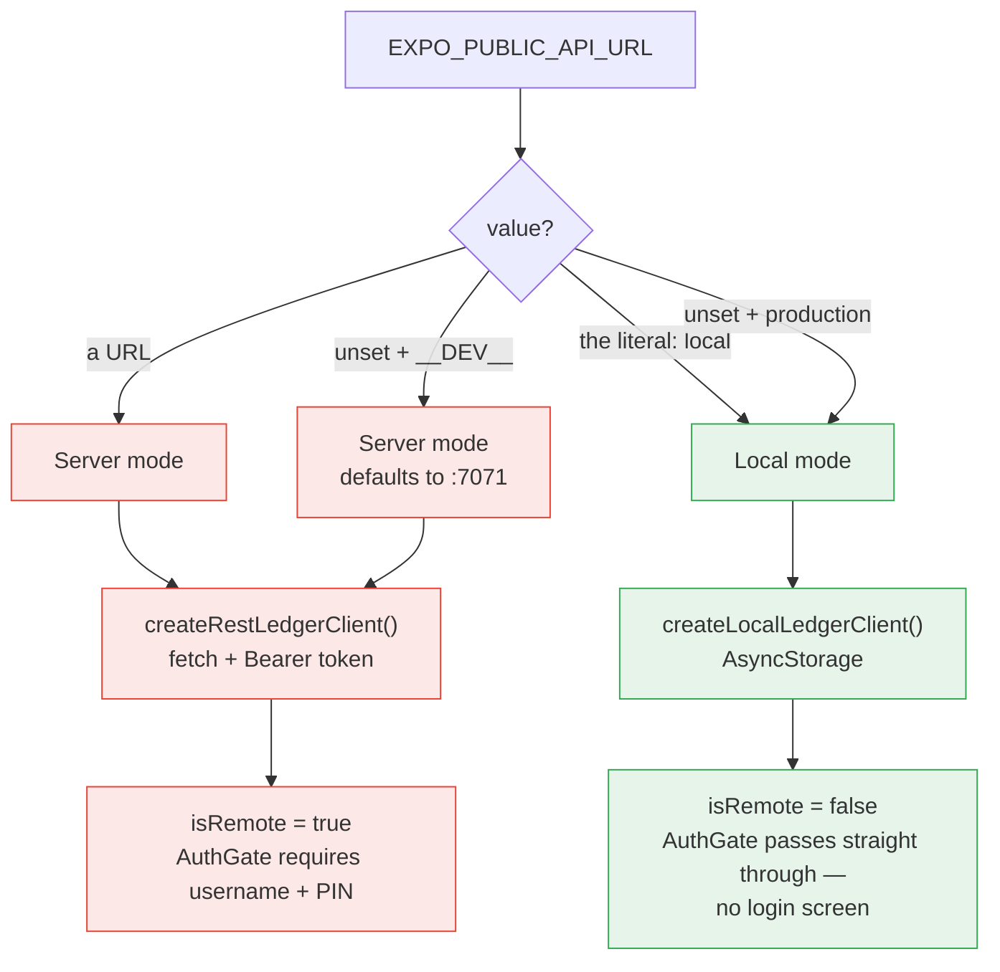
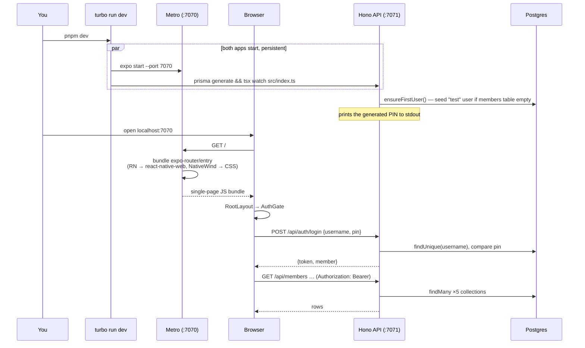
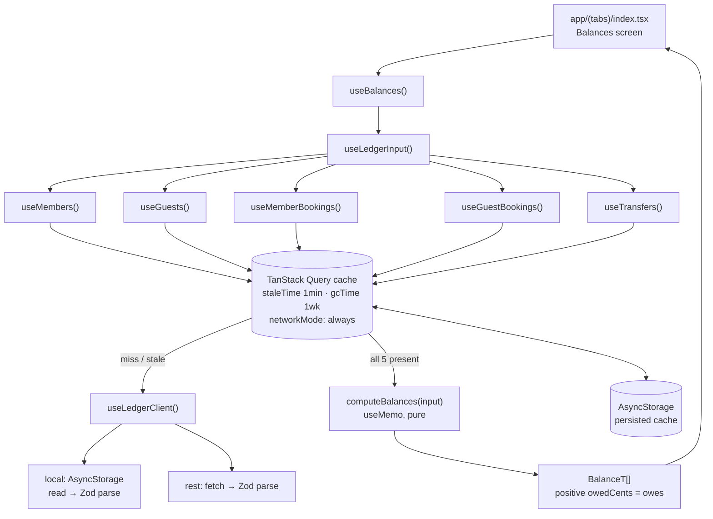
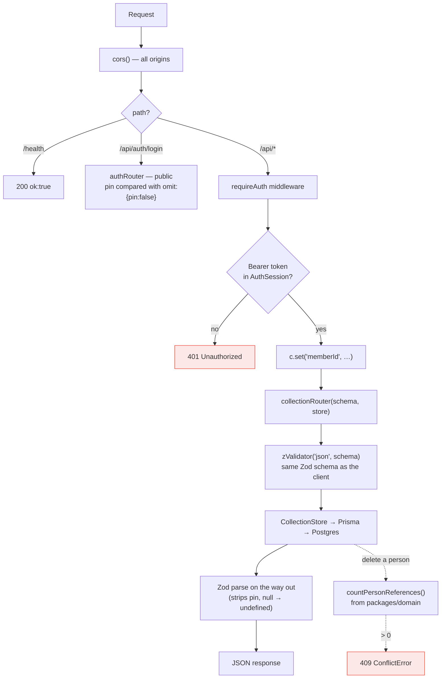

# Architecture — how the app runs

CourtPot is one Expo codebase that ships to **iOS, Android and web**. There is no separate
web app: the browser build is the same React Native tree rendered through
`react-native-web`, bundled by Metro. Alongside it sits an optional REST API
(`apps/server`) that the app can be pointed at instead of local device storage.

- Web dev server: **http://localhost:7070** (`apps/mobile`)
- API dev server: **http://localhost:7071** (`apps/server`)

---

## 1. Package graph

The monorepo enforces a strict one-directional dependency rule, so the money logic stays
testable without React, Expo, or a database anywhere near it.



`schemas` depends on nothing. `domain` depends only on `schemas` — no React, no Expo, no
Prisma — which is why the engine tests (`packages/domain/test/engine.test.ts`) run as plain
vitest with no harness.

Note that `packages/api` is shared by the app only; `apps/server` deliberately does **not**
import it. Instead it re-implements the same five-collection shape server-side
(`CollectionStore` in `apps/server/src/collections.ts` mirrors `CollectionClient` in
`packages/api/src/client.ts`), so the two sides agree by convention over a shared Zod schema
rather than by sharing transport code.

---

## 2. Two run modes

The same build runs either fully offline or against Postgres. The switch is one env var,
resolved in `apps/mobile/lib/config.ts`, and it decides two things at module load: which
`LedgerClient` gets built, and whether the login gate appears at all.



The dev default is deliberate: an unset var in development points at `localhost:7071` so
`pnpm dev` always exercises the login path. Set `EXPO_PUBLIC_API_URL=local` to get the
offline mode back without a server. A production build with the var unset falls back to
local mode — a shipped binary never guesses an API origin.

Because both clients satisfy the same `LedgerClient` interface, **no screen and no hook
knows which mode it is in.** Swapping persistence touches only `apps/mobile/lib/storage.ts`.

---

## 3. What happens on `pnpm dev` (web)



Two details specific to the web target:

- `app.json` sets `web.bundler: "metro"` and `web.output: "single"` — a client-rendered SPA,
  not static per-route HTML. Every Expo Router route is served by the same entry bundle.
- `AsyncStorage` on web is backed by `localStorage`. So both the ledger data in local mode
  and the persisted TanStack Query cache live in the browser's `localStorage`, which means
  they are per-origin and survive reload but not a different browser or profile.

The `prisma generate` in the server's `dev` script is load-bearing: `@prisma/client` is
hoisted to the repo root, so its install-time postinstall cannot find
`apps/server/prisma/schema.prisma` and leaves behind a stub that throws
`"@prisma/client did not initialize yet"`.

---

## 4. Read path — how a screen gets balances

Balances are never fetched and never stored. They are recomputed from the five cached
collections on every render, in the client, by the pure engine.



`networkMode: "always"` matters: in local mode there is no network, so the default
"pause when offline" behaviour would stall every query and mutation. The long `gcTime`
exists so the persisted cache is still useful after a cold start.

Because balances are derived from the cache rather than the server, an optimistic write
updates every balance on screen instantly — `useCollectionMutations` applies the row to the
cache in `onMutate`, rolls back in `onError`, and invalidates in `onSettled`. There is no
"recompute balances" request to wait for.

---

## 5. Server request pipeline

Every collection endpoint is generated from one function, so all five behave identically.



Two things worth knowing about this pipeline:

**PINs cannot leak by accident.** The Prisma client is constructed as
`new PrismaClient({ omit: { member: { pin: true } } })`, so `pin` is absent from every query
result process-wide. Exactly two call sites opt back in with `omit: { pin: false }` — the
login comparison and the operator CLI (`pnpm pins`). The type is encoded too:
`Db = PrismaClient<{ omit: { member: { pin: true } } }>`.

**Authorisation is coarse.** `requireAuth` establishes *that* a valid session exists and
stashes `memberId`, but no collection route reads it. Any signed-in member can read and
write every row — the model is a single shared club ledger, not per-user data. Worth
knowing before this is exposed to a wider group; the login is documented as intentionally
simple for now (plain PIN comparison, no rate limiting).

---

## Commands

```sh
pnpm install
pnpm dev                       # turbo: web on :7070 + API on :7071
pnpm --filter mobile web       # web only
pnpm --filter server dev       # API only (regenerates the Prisma client first)

pnpm test                      # engine scenario tests (vitest, packages/domain)
pnpm typecheck                 # strict TS across every package
pnpm lint
```

Server setup, first run:

```sh
cd apps/server
cp .env.example .env           # set DATABASE_URL
pnpm db:migrate                # prisma migrate deploy
pnpm dev                       # bootstraps a "test" user and prints its PIN if the DB is empty
pnpm pins                      # operator-only: print every member's PIN
```
