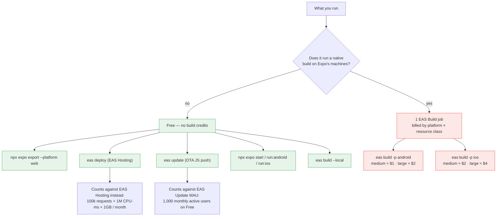
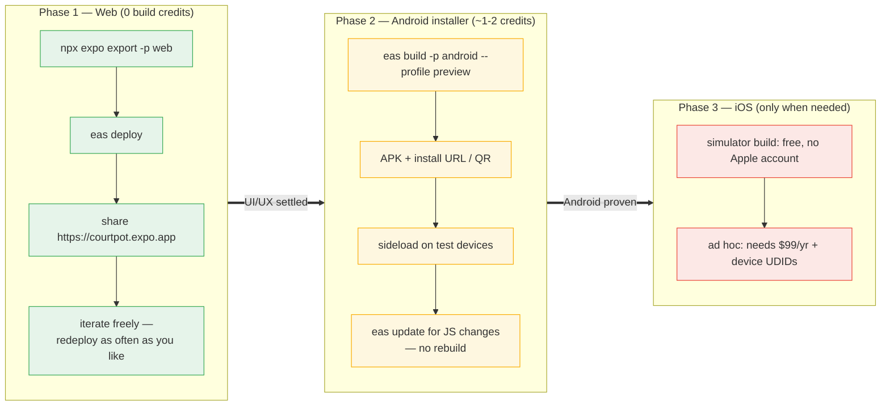
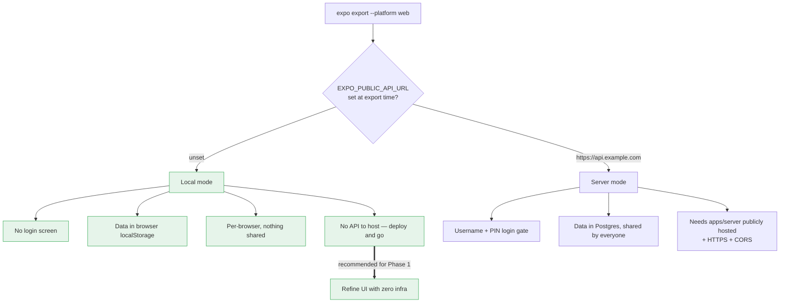
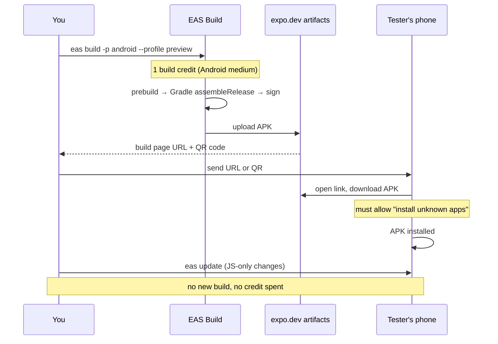
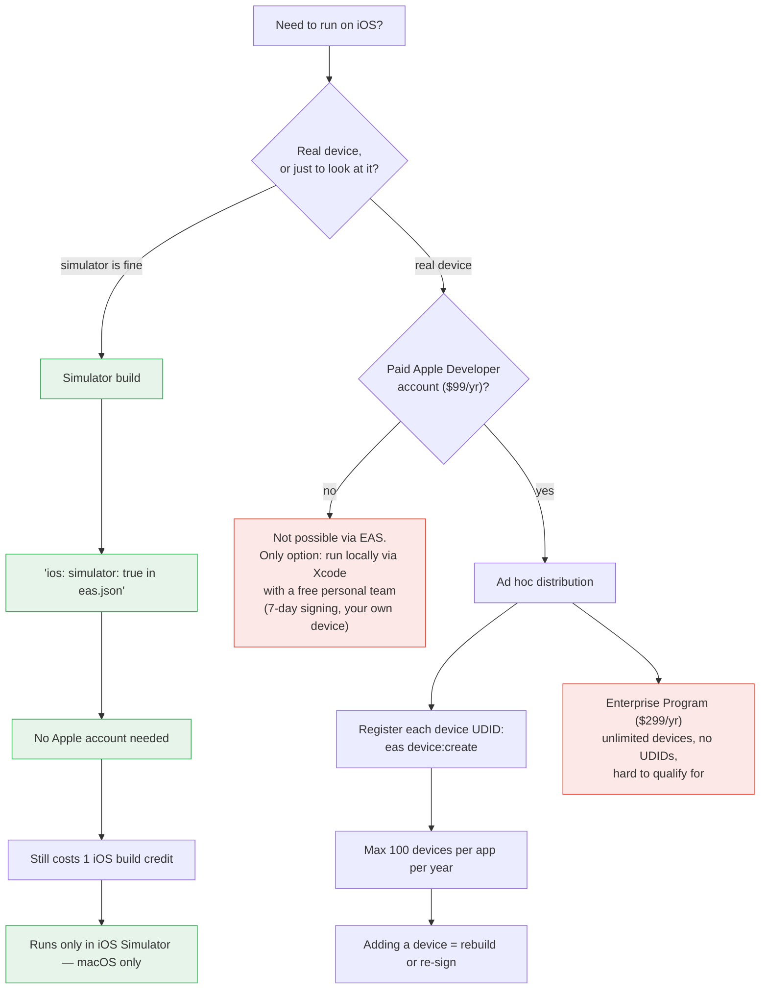

# Deployments — expo.dev, web and mobile installers

How to ship CourtPot without publishing to the App Store or Play Store, and how expo.dev
counts usage so a free plan goes as far as possible.

**Goal for now:** refine the app on web, then move to mobile installers later. That order is
also the cheapest order, because web deploys cost **zero build credits**.

> Prices and quotas below were checked against Expo's docs in July 2026. Expo changes them;
> re-check [expo.dev/pricing](https://expo.dev/pricing) before you rely on a number.

---

## 1. What actually counts toward expo.dev usage

The thing to internalise first: **your build profile is not what gets billed.** `development`,
`preview` and `production` in `eas.json` are just named config bundles. A `preview` build and a
`production` build of the same app cost exactly the same.

What determines cost is **platform × resource class**, and whether the job ran on Expo's
machines at all.



### The three separate meters

expo.dev bills three products independently. Confusing them is the usual cause of surprise
usage.

| Meter | What increments it | Free plan allowance |
|---|---|---|
| **EAS Build** | each remote native build job | 15 Android + 15 iOS per month, low-priority queue, 45-min timeout |
| **EAS Update** | monthly active users receiving OTA JS updates | 1,000 MAU |
| **EAS Hosting** | web requests / CPU-ms / storage | 100,000 requests, 1M CPU-ms, 1 GB |

Free plan also gets **1 build concurrency** — builds queue one at a time.

### Resource classes

`medium` is the default and is what you want. `large` doubles the machine (Android: 4→8 vCPU,
16→32 GB; iOS: 5→10 cores, 20→40 GiB) and roughly doubles the price. There is no reason to
touch it for an app this size.

### What does *not* burn a build

- **Cancelled before work starts** is not charged. A build that fails *after* starting
  generally is — so a broken `eas.json` or a missing credential can cost you a slot. Test
  config changes with `--local` first if you're near the cap.
- **`eas build --local`** runs the whole pipeline on your own machine and only talks to EAS for
  metadata. Widely used to avoid consuming credits, though Expo's docs don't state the quota
  behaviour explicitly — **verify on your billing page after your first local build** before
  building a workflow around it. Requires Xcode locally for iOS, JDK + Android SDK for Android.
- **OTA updates via `eas update`** ship new JS to an already-installed build without a rebuild.
  This is the big lever: once a tester has your APK, JS-only changes reach them for free.

---

## 2. Recommended path for this project



**Why this order suits the free plan:**

1. **Web costs no build credits.** Deploy 200 times a month if you want — you are only
   spending EAS Hosting requests, and 100k/month is far beyond what a club app in refinement
   will see. All layout, balance-engine and flow work belongs here.
2. **Web is the same React tree.** Because `react-native-web` renders the identical components,
   almost everything you fix on web is fixed on mobile. The exceptions are narrow: native
   gestures, safe-area insets, keyboard avoidance, and `Ionicons` sizing.
3. **Save your 15+15 for when the UI has stopped moving.** Each mobile build is a scarce slot.
   Spending them on layout tweaks is waste; spending them on "does this work on a real phone"
   is not.
4. **Then use OTA updates.** After one APK is installed on your testers' phones, `eas update`
   pushes JS changes to them with no further builds. You only need a *new* build when native
   config changes (new native dependency, `app.json` permissions, SDK upgrade).

**Concrete monthly budget on Free:** 1–2 Android builds when you start mobile, plus 1 iOS
simulator build if you want to check iOS rendering. That leaves ~13 Android and ~14 iOS slots
spare, and web iteration costs nothing.

---

## 3. Phase 1 — deploying the web app

`app.json` already sets `web.bundler: "metro"` and `web.output: "single"`, so the export is a
client-rendered SPA.

```sh
npm i -g eas-cli          # not currently installed in this repo
eas login

cd apps/mobile
npx expo export --platform web     # → apps/mobile/dist
eas deploy                         # first run asks for a preview subdomain
eas deploy --prod                  # promote to https://<subdomain>.expo.app
```

You must re-run `expo export` before every `eas deploy` — the deploy command uploads whatever
is in `dist`, it does not build.

URLs you get:

| Command | URL shape |
|---|---|
| `eas deploy` | `https://courtpot--<deployId>.expo.app` (immutable, per deploy) |
| `eas deploy --alias staging` | `https://courtpot--staging.expo.app` |
| `eas deploy --prod` | `https://courtpot.expo.app` |

Preview deploys being immutable and separately addressable is useful: send a specific
deploy URL for feedback without touching production.

### The one thing to decide before deploying web

`apps/mobile/lib/config.ts` resolves `EXPO_PUBLIC_API_URL` at build time, and in a
**production** export an unset value means **local mode**. That gives you two very different
deployments from the same code:



**Recommendation: do Phase 1 in local mode.** Deploy the web app with `EXPO_PUBLIC_API_URL`
unset and you get a working, shareable app with no server, no database and no auth to
maintain — ideal for refining screens and the balance engine. Switch to server mode only when
you actually need several people sharing one ledger.

Two blockers if you *do* want server mode on web now, neither of which the current setup
handles:

- **`localhost:7071` is meaningless to a browser on someone else's machine.** `apps/server`
  has to be deployed somewhere public with HTTPS. EAS Hosting won't do it — it serves the
  Expo export and Expo Router API routes, not a standalone Hono process. That needs Fly.io,
  Railway, Render or similar.
- **A browser calling HTTPS→HTTP is blocked as mixed content.** The API needs TLS. Server-side
  CORS is already wide open (`app.use("*", cors())`), so that part is fine.

---

## 4. Phase 2 — Android installer, no Play Store

**Your `eas.json` is already correct for this.** The `preview` profile has exactly what's
needed:

```json
"preview": {
  "distribution": "internal",
  "android": { "buildType": "apk" }
}
```

`buildType: "apk"` is the load-bearing part. The `production` profile has no `buildType`, so it
defaults to **AAB** — a Play Store upload format that **cannot be sideloaded**. Always use
`--profile preview` for installers.

```sh
cd apps/mobile
eas build --platform android --profile preview
```



Notes:

- EAS generates and stores an upload keystore for you on first build. Keep it — losing it
  matters if you ever go to the Play Store.
- Build URLs are public-by-default 32-char UUIDs. Anyone with the link can download. Require
  Expo account sign-in in project settings if that bothers you.
- Testers must enable "install unknown apps" for their browser. Expect to explain this once.

### Set the API URL for the build

`eas.json` currently has **no `env` block on any profile**, so an APK built today gets
`EXPO_PUBLIC_API_URL` unset → local mode → data stored on-device only. If you want the APK to
talk to a real API, add it explicitly:

```json
"preview": {
  "distribution": "internal",
  "android": { "buildType": "apk" },
  "env": { "EXPO_PUBLIC_API_URL": "https://your-api.example.com" }
}
```

A phone cannot reach your laptop's `localhost`. For local testing on the same wifi, use your
machine's LAN IP (`http://192.168.x.x:7071`) — and note Android blocks cleartext HTTP by
default on recent versions, so plain-HTTP LAN testing may need extra config. Local mode
sidesteps all of this.

---

## 5. Phase 3 — iOS without the App Store

iOS is where this gets expensive, which is why it goes last.



**Cheapest useful iOS check** — a simulator build, no Apple account at all:

```json
"preview-ios-sim": {
  "distribution": "internal",
  "ios": { "simulator": true }
}
```

```sh
eas build -p ios --profile preview-ios-sim
eas build:run -p ios --latest        # installs into your running simulator
```

This still consumes one iOS build credit, but needs no Apple money. For a web-first project
it's the right way to sanity-check iOS rendering before committing $99.

Also worth knowing: **TestFlight is not the App Store.** Internal TestFlight testing (up to 100
testers on your team) skips full App Review, so it's a legitimate no-store distribution route
— but it needs the $99 account and an App Store Connect record, so it's not cheaper than ad
hoc for a handful of testers.

---

## 6. Changes this repo needs before deploying

Ordered by when you'll hit them:

1. **`eas-cli` is not installed.** `npm i -g eas-cli`. `eas.json` requires `>= 16.0.0`.
2. **No `env` blocks in `eas.json`.** Every profile currently exports with
   `EXPO_PUBLIC_API_URL` unset → local mode. Fine if that's intended, surprising if not.
   Decide per profile and write it down.
3. **`appVersionSource: "remote"`** means expo.dev owns the version counter and `production`
   has `autoIncrement: true`. Nothing to do, but it's why local `app.json` version edits
   appear not to take effect.
4. **`apps/mobile/.env` holds a production Postgres URL with a plaintext password.** It is
   gitignored and, because Expo only inlines `EXPO_PUBLIC_*` variables, it will not reach a web
   bundle. But the mobile app has no use for `DATABASE_URL` at all — it belongs in
   `apps/server/.env`. Worth deleting from there.
5. **No web deploy script.** Consider adding to `apps/mobile/package.json`:
   ```json
   "deploy:web": "expo export --platform web && eas deploy",
   "deploy:web:prod": "expo export --platform web && eas deploy --prod"
   ```
   This guarantees the export-before-deploy ordering that `eas deploy` does not enforce.

---

## Command reference

```sh
# Web — free, no build credits
npx expo export --platform web
eas deploy                                  # preview URL
eas deploy --prod                           # production URL

# Android installer — 1 credit
eas build -p android --profile preview      # APK, internal distribution
eas build -p android --profile preview --local   # on your machine instead

# iOS — 1 credit each
eas build -p ios --profile preview-ios-sim  # simulator, no Apple account
eas build -p ios --profile preview          # ad hoc, needs $99/yr + UDIDs
eas device:create                           # register a test device

# OTA JS updates — no build credits
eas update --branch preview

# Housekeeping
eas build:list
eas build:run -p android --latest
```

## Sources

- [Expo Application Services pricing](https://expo.dev/pricing)
- [Internal distribution](https://docs.expo.dev/build/internal-distribution/)
- [Usage-based pricing](https://docs.expo.dev/billing/usage-based-pricing/)
- [Subscriptions, plans, and add-ons](https://docs.expo.dev/billing/plans/)
- [Build server infrastructure / resource classes](https://docs.expo.dev/build-reference/infrastructure/)
- [Local builds with `--local`](https://docs.expo.dev/build-reference/local-builds/)
- [iOS simulator builds](https://docs.expo.dev/build-reference/simulators/)
- [EAS Hosting — get started](https://docs.expo.dev/eas/hosting/get-started/)
- [EAS Hosting — deployments and aliases](https://docs.expo.dev/eas/hosting/deployments-and-aliases/)
