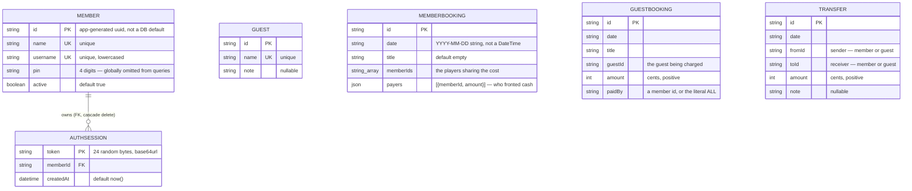
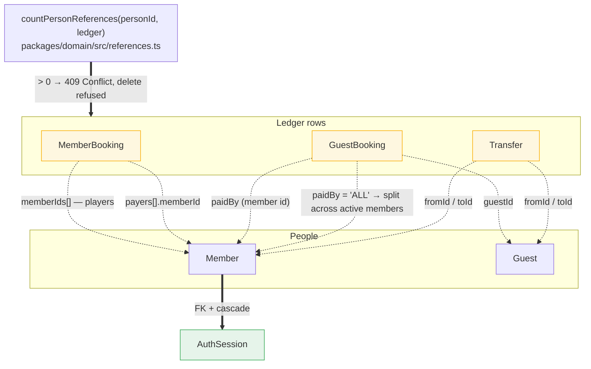
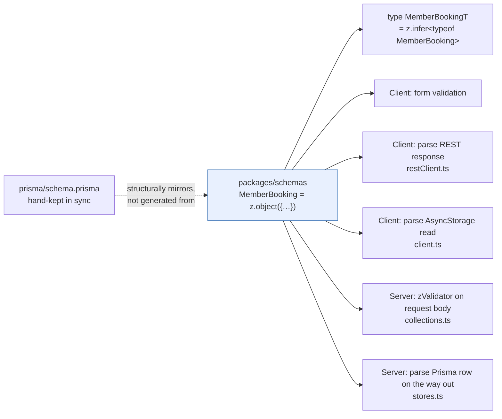
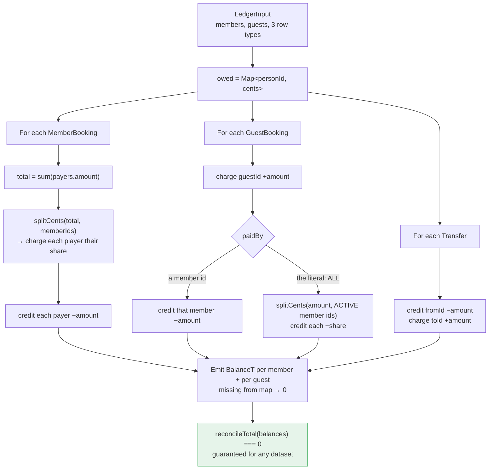
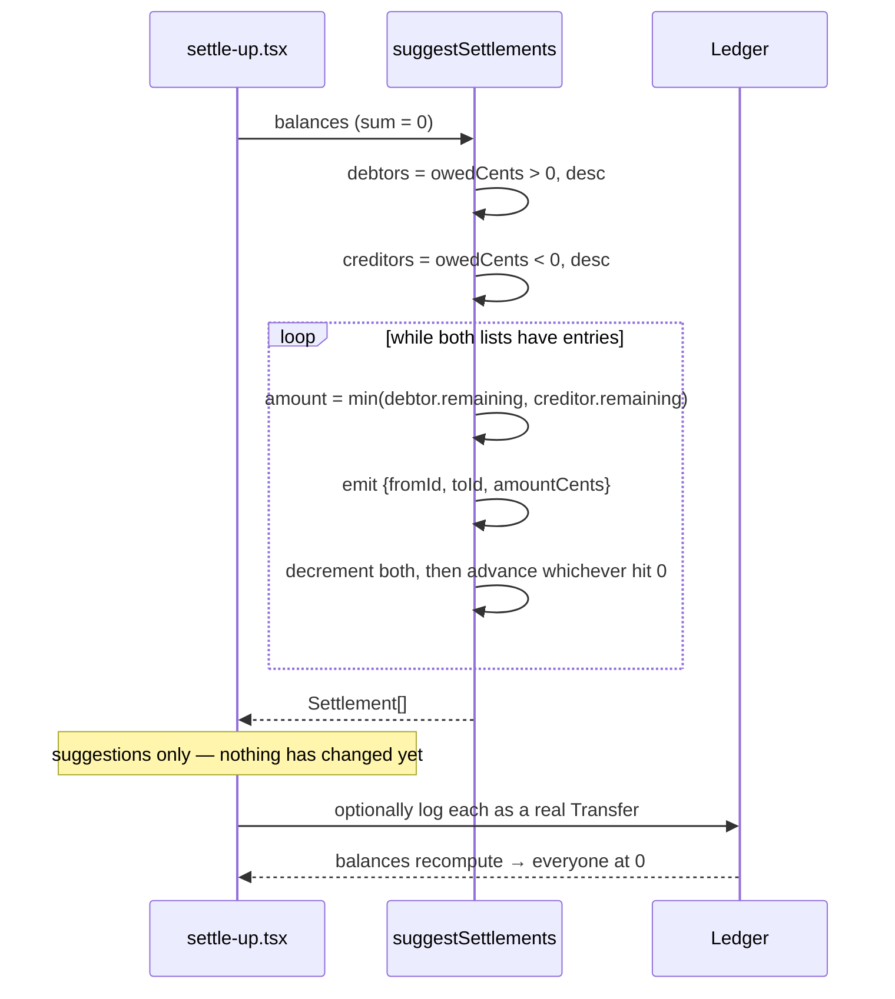

# Models — entities and their relationships

There are **six persisted entities** and one derived one. Two kinds of people (`Member`,
`Guest`), three kinds of ledger rows (`MemberBooking`, `GuestBooking`, `Transfer`), one
session table (`AuthSession`), and `Balance` — which is computed, never stored.

All money is **integer cents**. `4800` means $48.00. Formatting to `$` happens only at the
display edge via `formatCents`.

---

## 1. The persisted schema



Three modelling choices to be aware of:

- **`date` is a `String`, not a `DateTime`.** It holds a local calendar day (`YYYY-MM-DD`,
  enforced by the `IsoDate` Zod regex). A booking happened on a day, not at an instant, so
  storing a timestamp would invite timezone bugs and force an arbitrary time-of-day.
- **`id` is app-generated.** No `@default(uuid())` — the client mints the uuid so an
  optimistic cache write and the eventual server row share an identity, and offline-created
  rows keep the same id when they sync.
- **`payers` is `Json`.** A payer is `{memberId, amount}` and is only ever read as part of
  its booking, so it is embedded rather than given a table. `MemberBooking.payers` is
  validated by Zod on both sides of the wire, which is what keeps the untyped `Json` column
  honest.

The diagram above uses **Prisma model** names. The **database** names differ: tables are
plural `snake_case` and columns are `snake_case`, applied with `@@map` / `@map`, so no
identifier ever needs quoting in raw SQL.

| Prisma model | Postgres table | Mapped columns |
|---|---|---|
| `Member` | `members` | — |
| `Guest` | `guests` | — |
| `MemberBooking` | `member_bookings` | `memberIds` → `member_ids` |
| `GuestBooking` | `guest_bookings` | `guestId` → `guest_id`, `paidBy` → `paid_by` |
| `Transfer` | `transfers` | `fromId` → `from_id`, `toId` → `to_id` |
| `AuthSession` | `auth_sessions` | `memberId` → `member_id`, `createdAt` → `created_at` |

Application code only ever sees the Prisma names, so this mapping is invisible outside
`schema.prisma` and hand-written SQL.

---

## 2. Referential integrity lives in application code

Only one real foreign key exists in the whole schema: `AuthSession.memberId → Member.id`.
Every other person reference is a bare `String` column with no DB-level constraint.



`==>` is a database-enforced relation. `-.->` is a reference the database knows nothing
about.

The consequence: deleting a person cannot be left to Postgres. Before any delete, the server
loads the entire ledger and calls `countPersonReferences`; a non-zero count raises
`ConflictError` → HTTP 409. The same pure function is available to the app, so the UI can
grey out a delete before the user tries it.

The trade-off is deliberate but real — `Transfer.fromId` can point at either a `Member` or a
`Guest`, which no single FK can express, and `paidBy` can be the sentinel `"ALL"` rather than
any id at all. The cost is that nothing but application code stops an orphaned row, and the
integrity check is O(whole ledger) per delete.

---

## 3. One source of truth for types

Types are not declared per layer. `packages/schemas` holds Zod schemas, TypeScript types are
*inferred* from them, and the same schema object validates at every boundary.



Data is Zod-parsed **five times** on a round trip, including on the way out of Prisma. That
last one is not paranoia — it does real work: it strips `pin` (because `Member` is a
non-strict Zod object, parsing silently drops unknown keys) and it converts Prisma's `null`
to the `undefined` the schemas declare for optional fields.

The one seam to watch: **`schema.prisma` is not generated from the Zod schemas.** Adding a
field means editing both, and nothing fails at build time if you forget. `MemberCreate` is
where they diverge on purpose — it is `Member` extended with a mandatory `username`, since
server mode requires one but local mode has no logins.

---

## 4. How balances are derived

`computeBalances` walks every row once and accumulates a single `owedCents` per person.
**Positive means the person owes money; negative means they are owed.**



Every operation is a matched pair of a charge and a credit of the same magnitude, so the sum
of all balances is always exactly zero. `reconcileTotal` asserts it, and the engine tests
check it across scenarios. Exactness depends on `splitCents` never losing a cent:

```
splitCents(1000, [a, b, c])  →  base = floor(1000/3) = 333, remainder = 1
                             →  {a: 334, b: 333, c: 333}   sums to exactly 1000
```

The remainder cents go one each to the first ids in **sorted id order**, which makes the
result deterministic rather than fair-over-time — the same person absorbs the extra cent for
a given group. Two details that are easy to miss:

- `paidBy: "ALL"` splits across **active members only**. Deactivating a member therefore
  changes the balances of *past* `"ALL"` bookings, because nothing is snapshotted.
- Guests appear in the output with a balance but are never funders of an `"ALL"` booking and
  never members of a `MemberBooking`.

---

## 5. Settling up

`suggestSettlements` turns the balance list into the smallest practical set of payments,
greedily matching the largest debtor to the largest creditor.



A settlement is a *suggestion* until the user logs it. Writing them creates ordinary
`Transfer` rows — there is no distinct "settlement" entity — and because balances are derived
from those rows, the ledger lands at zero through the same code path as any other transfer.
Ties are broken by `id.localeCompare` so the suggested payments are stable between runs
rather than reshuffling on every render.

---

## Entity reference

| Entity | Persisted | Who it can reference | Notes |
|---|---|---|---|
| `Member` | yes | — | unique `name` + `username`; `active` flag gates `"ALL"` splits |
| `Guest` | yes | — | unique `name`, optional `note`; no login |
| `MemberBooking` | yes | members (players + payers) | cost = sum of payers, split equally among players |
| `GuestBooking` | yes | one guest, one member **or** `"ALL"` | guest charged, funder credited |
| `Transfer` | yes | any two people, member or guest | must differ (`refine`); sender credited |
| `AuthSession` | yes | one member (FK, cascade) | bearer token; no expiry column |
| `Team` | yes | — | unique `name` |
| `TeamMember` | yes | one team + one member (composite PK) | holds the per-team `role` |
| `AuditLog` | yes | acting member (FK, `SET NULL`) | append-only; `actorName` denormalised so entries outlive the actor |
| `Balance` | **no** | — | derived per render; sum always exactly 0 |
